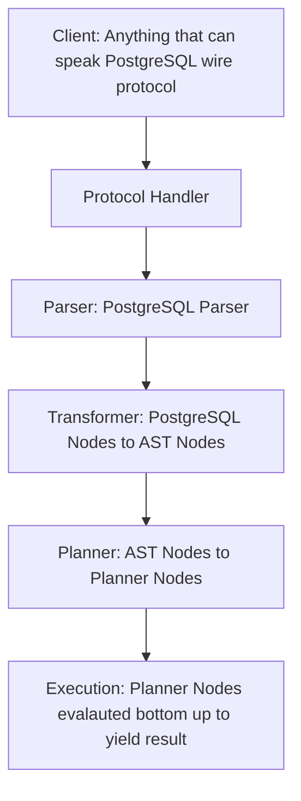

### FetaDB
FetaDB is a Work-In-Progress SQL Database backed by a KV store (Badger). It talks the PostgreSQL Wire Protocol but doesn't promise drop-in compatibility.

This is a small attempt to learn database internals!

### Overall Architecture


#### Supported Datatypes
Golang primitive types are supported: bool, string, unit*, int*, float*

#### Supported Column Constraints
Primary Key and Not-Null

#### Supported Features
* In-Memory & Disk Mode. Add option `-dbpath memory` or `-dbpath path/to/dir`
* Non Indexed Table Scan
* Joins (Nested Loop)
* Limited support for select, create table, insert into table. For example select does not support where filers
* Operator dispatch, supported `=`, `+`, `-`, `*`, `/` and `||`
* Functions dispatch, supported `lower`, `upper`, `md5`
* Sort (In-Memory)
* Group By, supported aggregations `sum`, `min`, `max`, `count`

#### Unsupported Features (Current)
* Non-trivial select, create, insert
* Scan Filter, Index Scan Filter
* Join (Hash & Merge)
* Secondary Indexes
* Type Checking on Insert

### Getting Started
#### Install PostgresSQL Client (MacOS)
```shell
brew install libpq
```

#### Run
```shell
go run fetadb
```

#### Connect via Client
```shell
# /usr/local/opt/libpq/bin/psql -h localhost
psql (16.3, server 16.0)
Type "help" for help.

mac=> CREATE TABLE Departments(DepartmentID uint64 PRIMARY KEY, DepartmentName string NOT NULL);

mac=> CREATE TABLE Employees(EmployeeID uint64 PRIMARY KEY, FirstName string NOT NULL, LastName string NOT NULL, DepartmentID uint64, Salary float64);

mac=> INSERT INTO Departments (DepartmentID, DepartmentName) 
      VALUES (1, 'HR'), (2, 'IT'), (3, 'Finance'), (4, 'Marketing'), (5, 'Operations', 6, 'Research');
      
mac=> INSERT INTO Employees (EmployeeID, FirstName, LastName, DepartmentID, Salary)
      VALUES  (1, 'John', 'Doe', 1, 60000),
              (2, 'Jane', 'Smith', 2, 75000),
              (3, 'Mike', 'Johnson', 3, 65000),
              (4, 'Emily', 'Brown', 2, 72000),
              (5, 'David', 'Lee', 4, 68000),
              (6, 'Sarah', 'Wilson', 1, 62000),
              (7, 'Tom', 'Davis', NULL, 55000),
              (8, 'Anna', 'Taylor', 3, 70000),
              (9, 'Chris', 'Anderson', 5, 58000),
              (10, 'Lisa', 'Thomas', NULL, 59000);

mac=> select Employees.EmployeeID, Employees.FirstName, Employees.LastName, Employees.DepartmentID, Employees.Salary 
      FROM Employees
      ORDER BY Employees.departmentid DESC, Employees.salary ASC;
 employees.employeeid | employees.firstname | employees.lastname | employees.departmentid | employees.salary
----------------------+---------------------+--------------------+------------------------+------------------
 9                    | "Chris"             | "Anderson"         | 5                      | 58000
 5                    | "David"             | "Lee"              | 4                      | 68000
 3                    | "Mike"              | "Johnson"          | 3                      | 65000
 8                    | "Anna"              | "Taylor"           | 3                      | 70000
 4                    | "Emily"             | "Brown"            | 2                      | 72000
 2                    | "Jane"              | "Smith"            | 2                      | 75000
 1                    | "John"              | "Doe"              | 1                      | 60000
 6                    | "Sarah"             | "Wilson"           | 1                      | 62000
 7                    | "Tom"               | "Davis"            | null                   | 55000
 10                   | "Lisa"              | "Thomas"           | null                   | 59000
(10 rows)

mac=> SELECT Employees.EmployeeID, Employees.FirstName, Employees.LastName, Departments.DepartmentName
      FROM Employees 
      INNER JOIN Departments
      ON Employees.DepartmentID = Departments.DepartmentID;
 employees.employeeid | employees.firstname | employees.lastname | departments.departmentname
----------------------+---------------------+--------------------+----------------------------
 1                    | "John"              | "Doe"              | "HR"
 2                    | "Jane"              | "Smith"            | "IT"
 3                    | "Mike"              | "Johnson"          | "Finance"
 4                    | "Emily"             | "Brown"            | "IT"
 5                    | "David"             | "Lee"              | "Marketing"
 6                    | "Sarah"             | "Wilson"           | "HR"
 8                    | "Anna"              | "Taylor"           | "Finance"
 9                    | "Chris"             | "Anderson"         | "Operations"
(8 rows)

mac=> SELECT Employees.EmployeeID, Employees.FirstName, Employees.LastName, Departments.DepartmentName 
      FROM Employees 
      LEFT JOIN Departments 
      ON Employees.DepartmentID = Departments.DepartmentID;
 employees.employeeid | employees.firstname | employees.lastname | departments.departmentname
----------------------+---------------------+--------------------+----------------------------
 1                    | "John"              | "Doe"              | "HR"
 2                    | "Jane"              | "Smith"            | "IT"
 3                    | "Mike"              | "Johnson"          | "Finance"
 4                    | "Emily"             | "Brown"            | "IT"
 5                    | "David"             | "Lee"              | "Marketing"
 6                    | "Sarah"             | "Wilson"           | "HR"
 7                    | "Tom"               | "Davis"            | null
 8                    | "Anna"              | "Taylor"           | "Finance"
 9                    | "Chris"             | "Anderson"         | "Operations"
 10                   | "Lisa"              | "Thomas"           | null
(10 rows)

mac=> SELECT Departments.DepartmentID, Departments.DepartmentName, Employees.EmployeeID, Employees.FirstName, Employees.LastName, Employees.Salary
      FROM Employees
      RIGHT JOIN Departments
      ON Employees.DepartmentID = Departments.DepartmentID
      ORDER BY Departments.DepartmentID, Employees.EmployeeID;
 departments.departmentid | departments.departmentname | employees.employeeid | employees.firstname | employees.lastname | employees.salary
--------------------------+----------------------------+----------------------+---------------------+--------------------+------------------
 1                        | "HR"                       | 1                    | "John"              | "Doe"              | 60000
 1                        | "HR"                       | 6                    | "Sarah"             | "Wilson"           | 62000
 2                        | "IT"                       | 2                    | "Jane"              | "Smith"            | 75000
 2                        | "IT"                       | 4                    | "Emily"             | "Brown"            | 72000
 3                        | "Finance"                  | 3                    | "Mike"              | "Johnson"          | 65000
 3                        | "Finance"                  | 8                    | "Anna"              | "Taylor"           | 70000
 4                        | "Marketing"                | 5                    | "David"             | "Lee"              | 68000
 5                        | "Operations"               | 9                    | "Chris"             | "Anderson"         | 58000
 6                        | "Research"                 | null                 | null                | null               | null
(9 rows)

mac=> select Employees.DepartmentID, min(Employees.Salary) as minSalary from Employees GROUP BY Employees.DepartmentID;
 employees.departmentid | minsalary
------------------------+-----------
 1                      | 60000
 2                      | 72000
 3                      | 65000
 4                      | 68000
 null                   | 55000
 5                      | 58000
(6 rows)

mac=> select Employees.DepartmentID, max(Employees.Salary) as maxSalary from Employees GROUP BY Employees.DepartmentID;
 employees.departmentid | maxsalary
------------------------+-----------
 1                      | 62000
 2                      | 75000
 3                      | 70000
 4                      | 68000
 null                   | 59000
 5                      | 58000
(6 rows)

mac=> select Employees.DepartmentID, count() as count from Employees GROUP BY Employees.DepartmentID;
 employees.departmentid | count
------------------------+-------
 1                      | 2
 2                      | 2
 3                      | 2
 4                      | 1
 null                   | 2
 5                      | 1
(6 rows)

mac=> select Employees.DepartmentID, sum(Employees.Salary) from Employees GROUP BY Employees.DepartmentID;
 employees.departmentid | _eval_.sum(employees.salary)
------------------------+------------------------------
 1                      | 122000
 2                      | 147000
 3                      | 135000
 4                      | 68000
 null                   | 114000
 5                      | 58000
(6 rows)

mac=> select Employees.DepartmentID, avg(Employees.Salary) from Employees GROUP BY Employees.DepartmentID;
 employees.departmentid | _eval_.avg(employees.salary)
------------------------+------------------------------
 1                      | 61000
 2                      | 73500
 3                      | 67500
 4                      | 68000
 null                   | 57000
 5                      | 58000
(6 rows)

mac=> select Employees.DepartmentID, max(Employees.Salary) - min(Employees.Salary) from Employees GROUP BY Employees.DepartmentID;
 employees.departmentid | _eval_.max(employees.salary) - min(employees.salary)
------------------------+------------------------------------------------------
 1                      | 2000
 2                      | 3000
 3                      | 5000
 4                      | 0
 null                   | 4000
 5                      | 0
(6 rows)

```

### References
- [MyRocks (Facebook's Storage Engine based on RocksDB) KV Encoding](https://github.com/facebook/mysql-5.6/wiki/MyRocks-record-format)
- [CockroachDB KV Encoding (New)](https://github.com/cockroachdb/cockroach/blob/master/docs/tech-notes/encoding.md)
- [CockroachDB KV Encoding (Old)](https://www.cockroachlabs.com/blog/sql-in-cockroachdb-mapping-table-data-to-key-value-storage/)
- [PostgreSQL Frontend/Backend Protocol](https://www.postgresql.org/docs/current/protocol.html)
